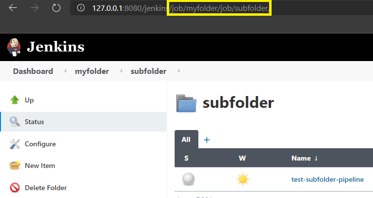
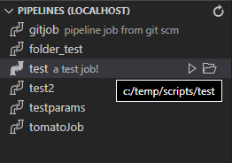

# Change Log
All notable changes to the `jenkins-jack` extension will be documented in this file.

## 1.2.1

## Added
* __Multi Download Support for Build Logs and Replay Scripts:__ Users can now select more than one build for download logs and replay scripts. When multiple items are selected, an individual document/tab will be created for each download.
  > __NOTE:__ Multi-item downloads will always open up multiple documents in the editor, regardless of the output view the user has defined for `jenkins-jack.outputView.type` in `settings.json`.

### Fixed
* Broken `extension.jenkins-jack.build.open` command from the last update.
* Fixed silent exception when item retrieval in `getChildren` for tree classes are undefined.
* Removed `password` field from connection contribution point in `package.json`.

## 1.2.0

Bumping minor version to accommodate a potentially breaking change to how connection passwords are stored. See __Changed__ section for details.

### Added
* __Quick Folder Select for Active Connection:__ Users can now update the folder filter for the active connection on the fly without needing to edit the entire connection (`Connections: Select Folder`).
* __Queue Jack and Queue TreeView:__ Allows the user to view items in the queue of the connected Jenkins. Users can also cancel one or more queued items (`Queue: Cancel`).
* __Node Tree View Executors:__ The node tree now displays available executors for each node, along with active builds occupying these executors. This is similar to the agent/node pane on the left-hand side of a Jenkins' main page. Build operations can also be invoked on these items, such as `Abort` or `Download Log`.
* __Jenkins Jack Log Output:__ Added a logger that writes to an output channel called `Jenkins Jack Log` to surface debug and exception information.

### Changed
* __Password Stored on System Key-Store:__ To mitigate the security issue of connection passwords living in the `settings.json`, Jenkins Jack will now store a user's password for a connection/username under the local system's key-store using `keytar`:
  *  New connections will automatically store  passwords on the key-store.
  *  Existing connections in `settings.json` with a `password` field will prompt the user on extension startup if they would like to migrate these passwords to the key-store and remove them from `settings.json`.
  > __NOTE:__ If a user declines to migrate the passwords, the extension will prompt the user to re-enter a password for the connection when attempting connect _if_ it is unable to locate it on the system's key-store
* __Removed Auth Information from Connection URL:__ The connection URL used for requests will no longer include the username/password in URL format and now utilizes authentication headers like every other application on planet earth. Apologies for how long this took.

## 1.1.6

### Features
* __Enable Build API Results Over 100 via `allBuilds`__: Any build operation will now prompt the user to enter a number of builds to retrieve (default 100). If over 100, the `allBuilds` field will be used within the query to pull more results.
  > __NOTE:__ Any value over 100, invoking the `allBuilds` filed, may have a performance impact on your Jenkins server due to it forcing the server (by default) to iterate over all builds.
* __Job Tree Number of Build Results:__ A new setting `jenkins-jack.job.tree.numBuilds` is now available for configuring the number of build results to return for a job expansion (default 100).
  > __NOTE:__ Same performance impact as above applies.

## 1.1.5

### Fixes
* __CSRF Protection Enabled for Connection Add Now Saving__: Fix for a bug where toggling the CSRF Protection Enabled while adding a connection wasn't being saved.

## 1.1.4

### Fixes
* __CSRF Enabled Toggle for Connection Manager__: Added a toggle-able quick-pick for enabling and disabling CSRF protection when adding or editing a connection. This already existed but was somewhat hidden from the user and documentation wasn't really apparent in the TUTORIAL.md.
  >__NOTE__: This should only be disabled for older [Jenkins versions](https://www.jenkins.io/doc/book/security/csrf-protection/) pre 2.222.
* __Connection Manager Password Field__: Password input box during connection add/edit is now set as "password input" so that characters aren't displayed when typing within the field.
* __Node Tree Offline Reason in Description__: Offline reason now displayed in the tree item description (if any).

## 1.1.3

### Features
* __Pipeline Jack: Create Job Command__: Added script/job/config create flow for scripted Pipeline jobs. This command will:
  *  Prompt the user for a job name and a folder path (or root) to create the job under
  *  Create the job on the Jenkins server
  *  Prompt the user to save a local script
  *  Auto-create the local pipeline config and link the local script for tree view commands
* __Added Folder Selection on Pipeline Execute Job Creation ([#56](https://github.com/tabeyti/jenkins-jack/issues/56))__: Executing/creating pipelines under a Folder job on the Jenkins server isn't intuitive or user friendly. Now, on job creation, the user will be presented with a list of folders to select from to create their new pipeline under.
* __Tree View Directory Separator Setting ([#47](https://github.com/tabeyti/jenkins-jack/issues/47))__: Users can specify what they want the directory separator string to be via the `jenkins-jack.tree.directorySeparator` setting. Default is `/`.

### Fixes
* __Fixed Broken Open Browser Links ([#49](https://github.com/tabeyti/jenkins-jack/issues/49))__: Fixed usage of `Url.pathname` on a jenkins connection with a path (e.g. http://myhost/jenkins) which caused issues with url creation links for opening jobs/builds/nodes in the browser.
* __Fixed Job/Folder Naming Issues with Pipeline Config__ ([#48](https://github.com/tabeyti/jenkins-jack/issues/48)): Fixed issue(s) around incorrect job name and folder paths being saved to a script's Pipeline json config.

## 1.1.2

### Fixes

* __Fixed Broken Folder Jobs ([#43](https://github.com/tabeyti/jenkins-jack/issues/43))__: Folder jobs were broken for script linking and pipeline execute due to job name assignment. Folder pipeline jobs can now be executed and should display with the folder path in the tree view.
* __Updated Folder Filter to Use Common Directory Path Structure__: The folder filter was introduce in the last update to allow a Jenkins connection to filter on a particular folder when querying jobs.
  The filter string format was originally to be a relative URI path to the folder (e.g. `job/myfolder/job/mysubfolder`). This messed with the Jenkins nodejs client on how jobs were queried. The filter now accepts a common directory path (e.g. `myfolder/mysubfolder`) for filtering, which requires the user to update their `folderFilter` to the new format.

## 1.1.1

### Features

* __Filter Jobs by Folder ([#40](https://github.com/tabeyti/jenkins-jack/issues/40))__: Connection configs now have an (optional) feature to limit extension job queries to a specific folder in Jenkins:
  ```javascript
  "jenkins-jack.jenkins.connections": [
    {
        "name":         "localhost",
        "uri":          "http://127.0.0.1:8080/jenkins",
        "username":     "myusername",
        "password":     "1231231231231231231231231231"
        // A relative URI folder path to the folder you want the extension to filter on
        "folderFilter": "job/myfolder"
    },
  ]
  ```

  If a user wanted filter on jobs that are in a sub-folder (nested folders)...
  

  ...the folder filter path would be:
  ```javascript
  "folderFilter": "job/myfolder/job/subfolder"
  ```

* __Pipeline Log Line Suppression Setting ([#30](https://github.com/tabeyti/jenkins-jack/issues/30))__: A new setting/flag `jenkins-jack.outputView.suppressPipelineLog` is now available so that when set to `true`, will filter out all `[Pipeline]` log lines in user's output stream during Pipeline execution and build log download.

* __Additional Language Support ([#20](https://github.com/tabeyti/jenkins-jack/issues/20))__: Additional language IDs (e.g. `jenkinsfile`, `java`) are supported as valid languages for Pipeline execution.

### Fixed
* __Can't Execute/Update Jobs ([#38](https://github.com/tabeyti/jenkins-jack/issues/38))__: Fixed `forbidden` message appearing when users utilize non-api-token for authentication by setting `crumbIssuer: true` for Jenkins connections (CSRF protection).
  > __NOTE__: This is configurable for backwards compatibility against older Jenkins version (pre 2.222.1). If you are having connection problems after this change, the `crumbIssuer` can be disabled by modifying your specific Jenkins connection config located in `settings.json`:
  ```javascript
  "jenkins-jack.jenkins.connections": [
    {
        "name":       "localhost",
        "uri":        "http://127.0.0.1:8080",
        "username":   "myusername",
        "password":   "1231231231231231231231231231"
        // Add/set "crumbIssuer" as "false" to disable CSRF protection
        "crumbIssuer": false
    },
  ]
  ```

* __Username/Password URI Encoding Fix ([#41](https://github.com/tabeyti/jenkins-jack/issues/41))__: Both username and password fields are now URI encoded so that special characters are escaped in each connection field.

## 1.1.0

Massive update adding UI/Views, additional commands, bug fixes, and additional documentation.

### Features

#### Views

The extensions now comes with UI/Views for interacting with all Jacks. The views can be found in the activity bar on the left hand side of the editor (bow icon):


All commands a user can execute via the quickpick command list (`ctrl+shift+j`) can also be executed in the Views via context menu or buttons.

For common use, see [TUTORIAL.md](TUTORIAL.md).

#### Pipeline View

This is a specialized view for managing your local Pipeline scripts in associations with Pipeline jobs discovered on the targeted Jenkins host. Linked jobs can be quickly opened and executed using the appropriate buttons.



This view also provides the ability to pull job/replay scripts for saving locally and linking to that job.

Job to local script configuration can be found in `settings.json` under `jenkins-jack.pipeline.tree.items`.

> **NOTE**:
> The tree view (currently) will not pull __Multibranch__ or __Org__ level jobs.
> For now the Pipeline Job Tree only works for standard Pipeline jobs. Yes, I am sad too.

#### Pipeline Jack
* __Folder Support__: Pipeline execution now supports Pipelines in folders! The folder path is entered/stored in the local script's json configuration under the `folder` property:
  ```javascript
  // For folder1/folder2/testjob
  // in config .testjob.config.json
  {
     "name": "testjob",
     "params": null,
     "folder": "folder1/folder2"
  }
  ```
* __Persist Jenkinsfile SCM configuration on Remote Job__: Executing a Pipeline script on a remote job with SCM information for using a Jenkinsfile will now silently save that SCM info and restore it after a build has started. Before the change, Pipeline execution would overwrite the job's config, embedding your script into the job and losing any SCM information that existed before.
* __Interactive Build Parameter Input__: When enabled in the settings, during Pipeline execution, the user will be presented with input boxes for each build parameter on the remote job. When disabled, will act as before and utilize build parameter values from the local script's Pipeline config (e.g. `.<myJob>.config.json`).
  > __NOTE__: This option is disabled as default, but can be enabled via `settings.json` under `jenkins-jack.pipeline.params.interactiveInput`.

#### Build Jack

* __Download Replay Scripts__: New command to download build replay scripts to your editor from a targeted Pipeline job and build number.

#### Node Jack

* __Update Labels__: New command to update the label strings on one or more agents.

### Other

* __Add/Delete/Edit Commands for Connections__: You can now manage your host connections through these new commands instead of modifying `settings.json` manually. Add/edit commands will present the user input boxes for the required connection fields.
* __Update Docs__: New docs for use ([TUTORIAL.md](TUTORIAL.md)) and command reference ([COMMANDS.md](COMMANDS.md))

### Fixed

* Fixed "Cannot Connect" message appearing even after a user enters valid Jenkins connection info.
* Fixed broken "jack" commands


## 1.0.1

* __Stream Output to Editor Window__: All output can now be streamed to an editor window instead of the user's Output Channel.

  The output view type can be set in settings via `jenkins-jack.outputView.type` contribution point.

  The default location of the `panel` view type can be set via `jenkins-jack.outputView.panel.defaultViewColumn` contribution point.

### Fixed
* Fixed issue where `Could not connect to the remote Jenkins` message would appear even after puting in correct connection information
* Fixed command `extension.jenkins-jack.jacks` quick pick spacer icon

## 1.0.0

First version. Yip skiddlee dooo!

## 0.1.6

* New [logo](./images/logo.png)

### Fixed
* Shared Library Reference now pulls definitions from any pipelines executed that include a shared lib (e.g. `@Library('shared')`).

## 0.1.6

* __Build Jack:__ Build description now given when showing the list of build numbers to download.

### Fixed
* Most "jacks" can now be invoked (`ctrl+shift+j`) without the need to be in a `groovy` file. Certain jack commands won't display if the view you are editing isn't set to the `groovy` language mode (e.g. Pipeline, Script Console)
* Fixed progress window text formating.

## 0.1.5

* __Job Jack:__ Execute disable, enable, and delete operations on one or more targeted jobs.
* __Node Jack:__ Execute set-online, set-offline, and disconnect operations on one or more targeted nodes.
* __Build Jack:__ Stream syntax higlighted build logs or delete one or more builds from a targeted job.

### Fixed
* Default host connection now populates with default values properly
* Fixed conditional logic for retrieving build numbers via jenkins url

## 0.1.4

* __Multiple Host Connection Support:__ Now supports multiple Jenkins host connections and the ability to swap between hosts (`ctrl+shift+j -> Host Selection`)

    __NOTE:__ Additional hosts are added via `settings.json` which can be found in Settings by typing `Jenkins Jack`.

* __Build Parameter Support for Pipeline Exection:__ Groovy files used for Pipeline execution now support parameters via a config file: `<FILE>.conf.json`. Config file will be created automatically if one doesn't exist for a groovy file.

* __Disabling Strict TLS:__ An option in Settings has been added to disable TLS checks for `https` enpoints that don't have a valid cert.

* __Better Jenkins URI Parsing:__ Now supports prefixed (`http`/`https`) URIs.

* __Progress Indicators Support Cancellation:__ Progress indicators now actually support canceling during pipeline execution, script console execution, or build log downloads.

### Fixed

* __Snippets Refresh Fix__: When host information is changed, snippets will now update GDSL global shared library definitions correctly without a need for restarting the editor.

## 0.1.3

### Fixed
- Broken `.pipeline` command in `packages.json`
- Create job hang for Pipeline fixed; better error handling.

## 0.1.2

### Fixed

- Snippets configuration now work

## 0.1.1
- Initial release