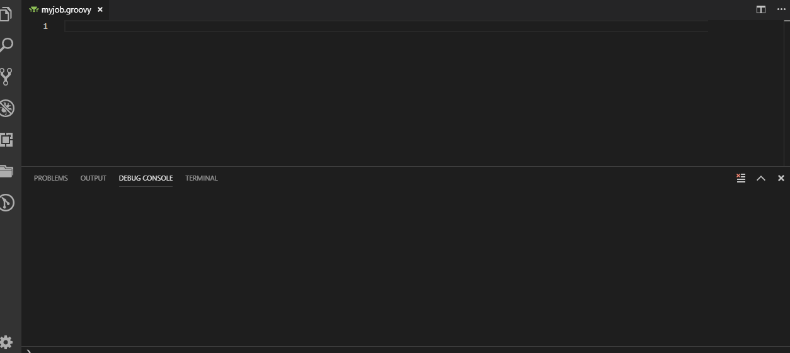

# Jenkins Jack

Jack into your remote Jenkins to execute Pipeline scripts, provide Pipeline step auto-completions, pull Shared Library step documenation, run console groovy scripts across multiple nodes, and more!

Honestly, not that much more.

## Features

### Auto-completions (faux snippets)

From your remote Jenkins, Jenkins Jack will pull, parse, and provide Pipeline steps as auto-completions from the Pipeline step definitions (GDSL).

Any `groovy` file in the editor will have these completions. This feature can be enabled/disabled via __Settings__ by searching for __Jenkins Jack__.

### Jacks:
|Jack|Description|Command|
|---|---|:---|
|Pipeline|Remotely build/abort/update Jenkins pipeline scripts from an open `groovy` file, streaming syntax highlighted output to the output console.|`extension.jenkins-jack.pipeline`|
|Script Console|Remote execute on the Jenkins Script Console from an open `groovy` file, targeting one or more nodes. Results will appearing in the output console.|`extension.jenkins-jack.scriptConsole`|
|Build Log|Allows the user to select a job and build to pull a log from the Jenkins host.|`extension.jenkins-jack.buildLog`|

## Setup
Jenkins Jack works by hooking into the user's running Jenkins instance via the Jenkins Remote API. Before you can use the plugin, you must fill in the extension settings to point to a Jenkins host(s) in `settings.json`:

```json
"jenkins-jack.jenkins.connections": [
    {
        "name": "localhost",
        "uri": "http://localhost:8080",
        "username": "drapplesauce",
        "password": "217287g126721687162f76f387fdsy7",
        "active": true
    }
]
```

You can get to this via the Settings UI (`ctrl+,`) and searching for `Jenkins Jack Connections`.

## Use

A list of all the commands can be provided in a quick pick by invoking the `jenkins-jack.jacks` command, currently mapped to the following hotkeys:
- (Windows/Linux): `ctrl+shift+j`
- (OSX): `super+shift+j` <- why you gotta be different?

## Packaging and Installation
To create a standalone `vsix` for installation locally, run the following commands:
```bash
# From the root of the extension.
npm install -g vsce # For packaging
npm install # Install dependencies.
vsce package # Bake some bread.
code --install-extension .\jenkins-jack-0.0.1.vsix # ...or whatever version was built
```

## Primary Commands

Navigate [here](./commands.md) for a list of primary commands this tool supports.

## Support
Do you have a feature request or would like to report a bug? Super duper! Create an issue via github's [issue tracker](https://github.com/tabeyti/jenkins-jack/issues).

Currently, there are no hard guidelines defined for feature requests, bugs, or questions since I have no idea what I'm doing. These will become more defined as interest in the project increases or something something.

## Authors

* **Travis Abeyti** - *Initial work*

## License

This project is licensed under the MIT License - see the [LICENSE.md](LICENSE.md) file for details. Do what you will with this.