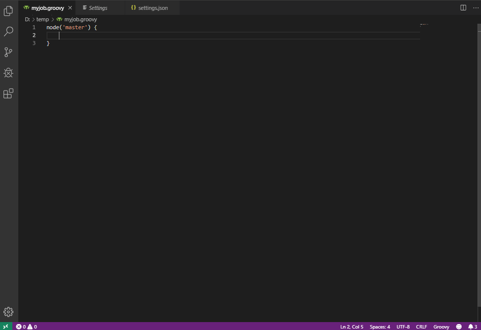

# Jenkins Jack

Jack into your remote Jenkins to execute Pipeline scripts, provide Pipeline step auto-completions, pull Shared Library step documenation, run console groovy scripts across multiple nodes, and more!

Honestly, not that much more.

## Features

* Pipeline Jack
    * Execute (with build paramaters)
        * Stream syntax highlighted output to output channel
    * Abort
    * Update
    * Shared Library reference docs
* Script Console Jack
    * Execute
* Node Jack
    * Set multiple nodes offline
    * Set multiple nodes online
    * Disconnect multiple nodes
* Job Jack
    * Disable multiple jobs
    * Enable mulitiple jobs
    * Delete multiple jobs
* Build Jack
    * Download a build log
    * Delete multiple builds
* Supports switching between Jenkins hosts for running commands
* Pipeline (GDSL) auto-completions for `groovy` files

## Extension Commands (Jacks!)

See [jacks](jacks.md) for a more comprehensive list of commands and features.

|Jack|Description|Command|
|---|---|:---|
|__Pipeline Jack__|Remotely build/abort/update Jenkins pipeline scripts from an open `groovy` file, streaming syntax highlighted output to the output console.|`extension.jenkins-jack.pipeline`|
|__Script Console Jack__|Remote execute on the Jenkins Script Console from an open `groovy` file, targeting one or more nodes. Results will appearing in the output console.|`extension.jenkins-jack.scriptConsole`|
|__Build Jack__|Select a job to download logs to display on the output window or to delete from the remote Jenkins.|`extension.jenkins-jack.build`|
|__Job Jack__|Select one or more jobs to disable, re-enable, or delete from the remote Jenkins.|`extension.jenkins-jack.job`|
|__Node Jack__|Select one or more nodes to set offine, online, or disconnect from the remote Jenkins.|`extension.jenkins-jack.node`|

Individual jacks can be mapped to hot keys as user sees fit.

## Auto-completions (faux snippets)

From your remote Jenkins, Jenkins Jack will pull, parse, and provide Pipeline steps as auto-completions from the Pipeline step definitions (GDSL).

Any `groovy` file in the editor will have these completions. This feature can be enabled/disabled via __Settings__ by searching for __Jenkins Jack__.

## Configuration
Jenkins Jack works by hooking into the user's running Jenkins instance via the Jenkins Remote API. Before you can use the plugin, you must fill in the extension settings to point to a Jenkins host(s) in `settings.json`:

```json
"jenkins-jack.jenkins.connections": [
    {
        "name": "localhost",                            // "name" can be seen in the host selection command
        "uri": "http://localhost:8080",
        "username": "drapplesauce",


        "password": "217287g126721687162f76f387fdsy7",  // gen API token via <your-jenkins>/user/<user name>/configure
                                                        // E.g. http://127.0.0.1:8080/user/drapplesauce/configure

        "active": true                                  // Indicates the active jenkins host you're connected to.
                                                        // Also set via host selection command
    }
]
```

You can get to this via the Settings UI (`ctrl+,`) and searching for `Jenkins Jack Connections`.

## Quick-use

### `ctrl+shift+j`

Displays a list of all Jack sub-commands provided by the extension (`jenkins-jack.jacks`)

## Local Packaging and Installation
To create a standalone `vsix` for installation locally, run the following commands:
```bash
# From the root of the extension.
npm install -g vsce # For packaging
npm install # Install dependencies.
vsce package # Bake some bread.
code --install-extension .\jenkins-jack-0.0.1.vsix # ...or whatever version was built
```

## Support
Do you have a feature request or would like to report a bug? Super duper! Create an issue via github's [issue tracker](https://github.com/tabeyti/jenkins-jack/issues).

Currently, there are no hard guidelines defined for feature requests, bugs, or questions since I have no idea what I'm doing. These will become more defined as interest in the project increases or something something.

## Authors

* **Travis Abeyti** - *Initial work*

## License

This project is licensed under the MIT License - see the [LICENSE.md](LICENSE.md) file for details. Do what you will with this.