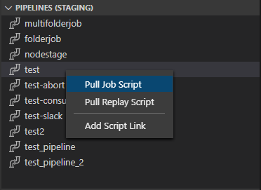
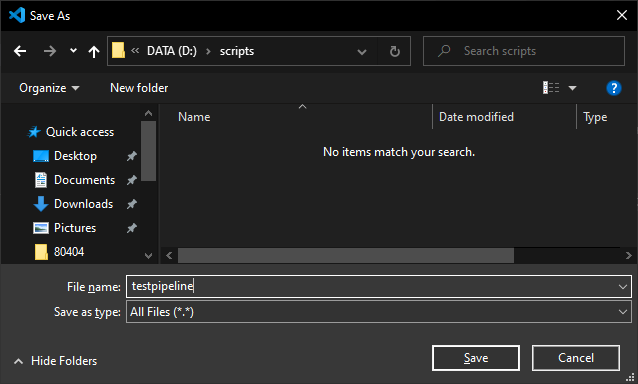

# Tutorial

## Setup

## Pipeline

The Pipeline Jack works by using the active Groovy file open in your editor for executing a job on the targeted host.

A user just needs to open a Pipeline script in VSCode with the Groovy language selected.

Another option is to pull a Pipeline script from the host for editing.

This is done in the Jenkins Jack Tree View under Pipeline by right clicking a Pipeline and selecting `Pull Job Script` and saving it locally with a file name of your choosing:

### Execute a Pipeline Script

